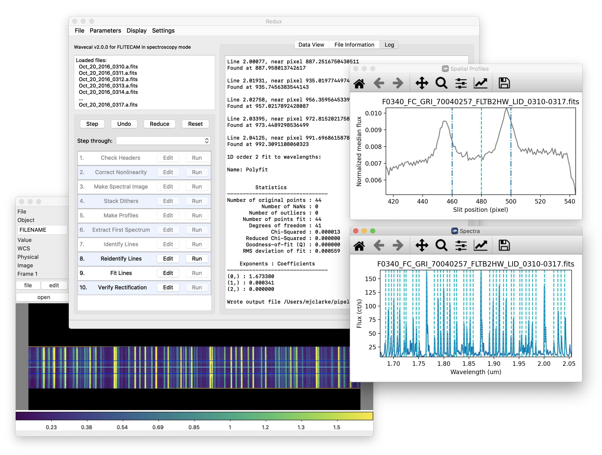
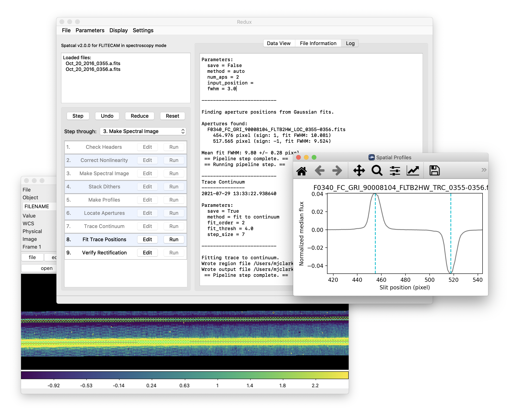
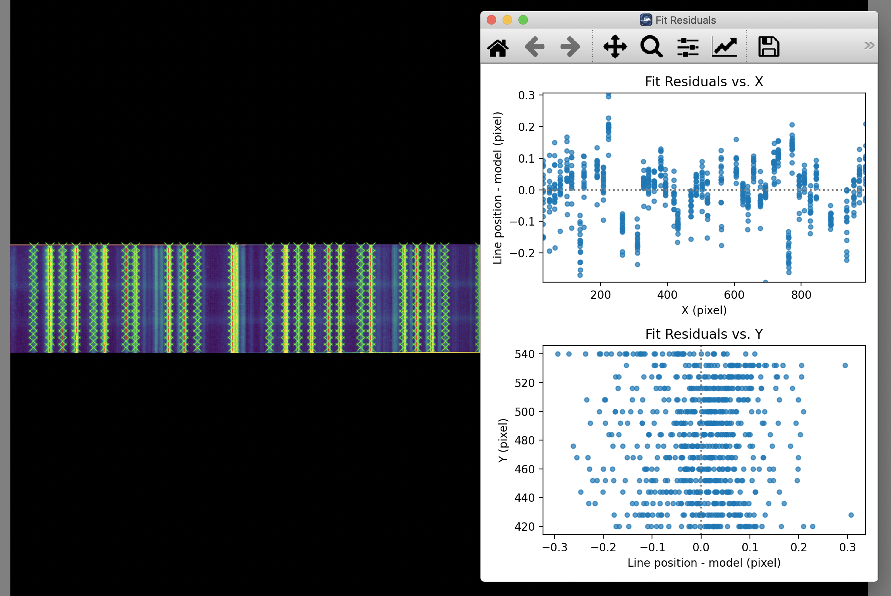
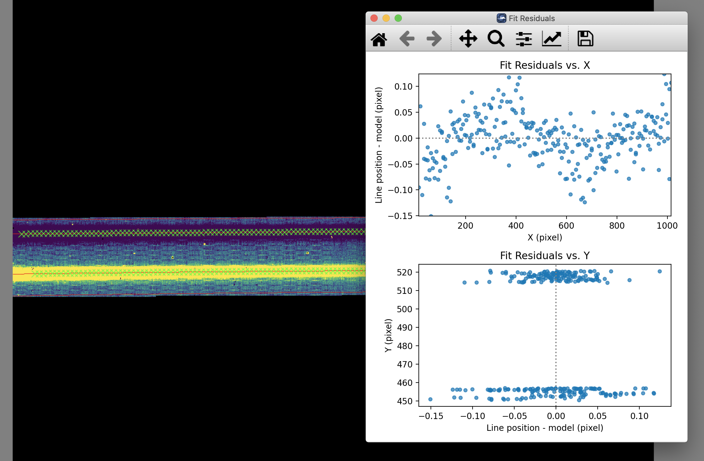

Appendix C: Calibration Data Generation
=======================================

The FLITECAM Redux pipeline requires several kinds of auxiliary reference
calibration files, listed in :numref:`flitecam_auxiliary`.  Some of these
are produced by tools packaged with the pipeline.  This section describes the
procedures used to produce these auxiliary files.

.. |ref_wavecal_plots| replace:: :numref:`flitecam_wavecal_plots`

.. |ref_spatcal_plots| replace:: :numref:`flitecam_spatcal_plots`

.. |ref_wavecal_residuals| replace:: :numref:`flitecam_wavecal_residuals`

.. |ref_spatcal_residuals| replace:: :numref:`flitecam_spatcal_residuals`

.. include::  ../../forcast/users/spectral_calibration.rst

         and a DS9 window showing a spectral image.

   Wavecal mode reduction and diagnostic plots.

   Spatcal mode reduction and diagnostic plots.

         showing fit residuals in X and Y.

   Wavecal mode fit surface and residuals.

         showing fit residuals in X and Y.

   Spatcal mode fit surface and residuals.
